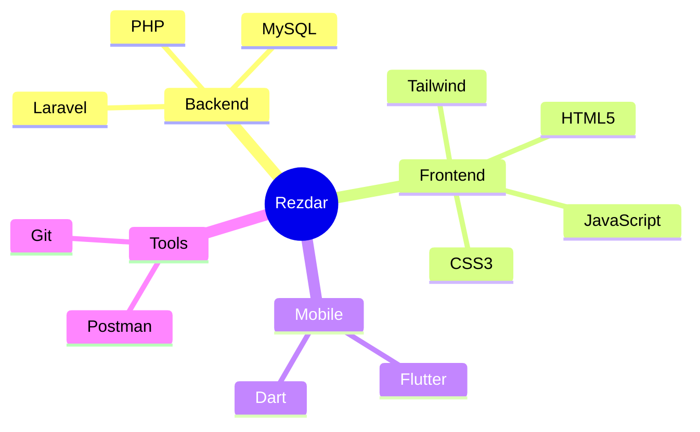

# 👋 Hi, I'm Rezdar Najeeb
### Software Engineer | Web Developer | Laravel Backend Specialist

<div align="center">
  
</div>

<p align="center">
  <a href="mailto:rezdar.00166214@gmail.com">
    
  </a>
  <a href="https://www.linkedin.com/in/rezdar-najeeb-52b794241">
    
  </a>
  <a href="https://buymeacoffee.com/rezdar">
    
  </a>
</p>

## 💫 About Me
```php
<?php

namespace App\Developers;

class RezdarNajeeb extends Developer
{
    public function getCurrentWorkplace(): array
    {
        return [
            'workplace' => [
                'position' => 'Software Engineer',
                'specialization' => 'Laravel Backend Specialist'
            ]
        ];
    }

    public function getDailyKnowledge(): array
    {
        return [
            Php::class,
            Laravel::class,
            Javascript::class,
            Flutter::class,
        ];
    }
}
```

## 🚀 Skills & Technologies

<p align="center">
  
  
  
  
  
  
  
  
  
  
  
  
</p>

## 🌟 Featured Projects

<div align="center">
  
</div>

### 🔥 My Development Stack


## 📫 Get in Touch
Feel free to reach out if you want to:
- 🤝 Collaborate on projects
- 💬 Discuss web development
- 🎯 Explore new opportunities

<div align="center">
  
</div>

---
<p align="center">☕ Want to support my work? <a href="https://buymeacoffee.com/rezdar">Buy me a coffee!</a></p>
