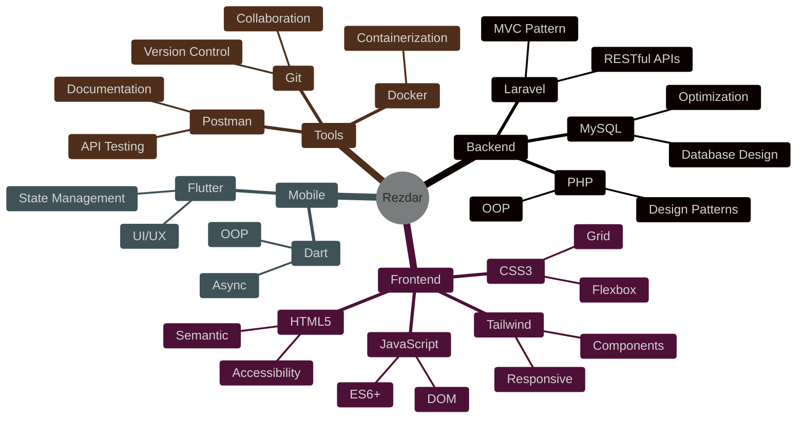

#  Hey there! I'm Rezdar Najeeb

<div align="center">
  
</div>

<div align="center">
  
</div>

<div align="center">
  <a href="mailto:rezdar.00166214@gmail.com">
    
  </a>
  <a href="https://www.linkedin.com/in/rezdar-najeeb-52b794241">
    
  </a>
  <a href="https://buymeacoffee.com/rezdar">
    
  </a>
</div>

##  About Me

<div align="center">
  
</div>

```php
<?php

namespace App\Developers;

class RezdarNajeeb extends Developer
{
    public function getCurrentWorkplace(): array
    {
        return [
            '🏢 workplace' => [
                '💼 position' => 'Software Engineer',
                '🎯 specialization' => 'Laravel Backend Specialist'
            ]
        ];
    }

    public function getDailyKnowledge(): array
    {
        return [
            '⚡ PHP' => ['Laravel', 'RESTful APIs', 'MVC Pattern'],
            '🚀 Frontend' => ['JavaScript', 'HTML5', 'CSS3', 'Tailwind'],
            '📱 Mobile' => ['Flutter', 'Dart'],
            '🛠 Tools' => ['Git', 'Postman', 'MySQL']
        ];
    }

    public function getFutureGoals(): array
    {
        return [
            '🎯 Master System Design Patterns',
            '🌟 Contribute to Open Source',
            '📚 Share Knowledge Through Blog Posts'
        ];
    }
}
```

##  Skills & Technologies

<div align="center">
  
</div>

##  My Development Stack

<div align="center">



</div>

##  Latest Projects

<div align="center">
  <picture>
    <source media="(prefers-color-scheme: dark)" srcset="https://raw.githubusercontent.com/platane/snk/output/github-contribution-grid-snake-dark.svg" />
    <source media="(prefers-color-scheme: light)" srcset="https://raw.githubusercontent.com/platane/snk/output/github-contribution-grid-snake.svg" />
    
  </picture>
</div>

##  Let's Connect!

<div align="center">
  <p>Feel free to reach out if you want to:</p>
  <ul align="left" style="list-style: none;">
    <li>🤝 Collaborate on exciting projects</li>
    <li>💬 Discuss web development and tech</li>
    <li>🎯 Explore new opportunities</li>
    <li>📚 Share knowledge and learn together</li>
  </ul>
</div>

<div align="center">
  
</div>

---
<div align="center">
  
  <br />
  <sub>Let's turn coffee into code! ☕️✨</sub>
</div>
